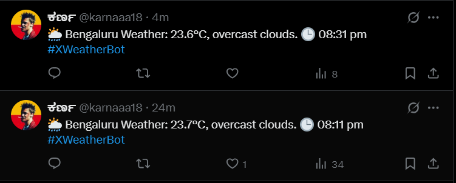

# 🌦 XWeather Bot



# 🌦 XWeather Bot

XWeather Bot is a Node.js application that automatically fetches real-time weather data from the **OpenWeather API** and posts updates to **Twitter/X** using the [twitter-api-v2](https://github.com/PLhery/node-twitter-api-v2) library.  

This project demonstrates automation, API integration, and social media posting.

---

## ✨ Features
- Fetches **live weather data** (temperature + description).
- Posts formatted **tweets** with weather info and timestamp.
- Runs **every 1 hour** automatically.
- Can be configured for any city.

---

## 🛠 Tech Stack
- **Node.js** (JavaScript runtime)  
- **twitter-api-v2** (Twitter/X API client)  
- **node-fetch** (HTTP requests)  
- **OpenWeather API** (weather data provider)  

---

## ⚙️ Setup Instructions

### 1. Clone the repository
```bash
git clone https://github.com/shodhan07/XWeatherJs.git
cd XWeatherJs
````

### 2. Install dependencies

```bash
npm install
```

### 3. Configure API Keys

Create a file named `config.js` in your project root (this file is already ignored by GitHub):

```javascript
// config.js
export const keys = {
  consumerKey: "YOUR_TWITTER_API_KEY",
  consumerSecret: "YOUR_TWITTER_API_SECRET",
  accessToken: "YOUR_TWITTER_ACCESS_TOKEN",
  accessTokenSecret: "YOUR_TWITTER_ACCESS_SECRET",
  weatherApiKey: "YOUR_OPENWEATHER_API_KEY"
};
```

> ⚠️ Never commit your keys to GitHub. They should always stay local.

### 4. Run the bot

```bash
node XWeather.js
```

---

## 📌 Example Tweet

```
🌦 Bengaluru Weather: 25.3°C, clear sky. 🕒 14:30 #XWeatherBot
```

---

## 🛑 Stopping the Bot

Press:

```
Ctrl + C
```

in terminal to stop execution.

---

## 🚀 Future Improvements

* Multi-city support
* Emoji-based weather updates ☀️ 🌧️ 🌩️
* Deploy on a cloud service (Heroku / Render / Railway)

---

## 📜 License

This project is for **educational and personal use only**.
Not intended for commercial purposes.

```

---

✅ Copy this **once** into `README.md` in VS Code, save, commit, and push.  

Do you also want me to give you the **git commands** for adding + committing the README in one go?
```
